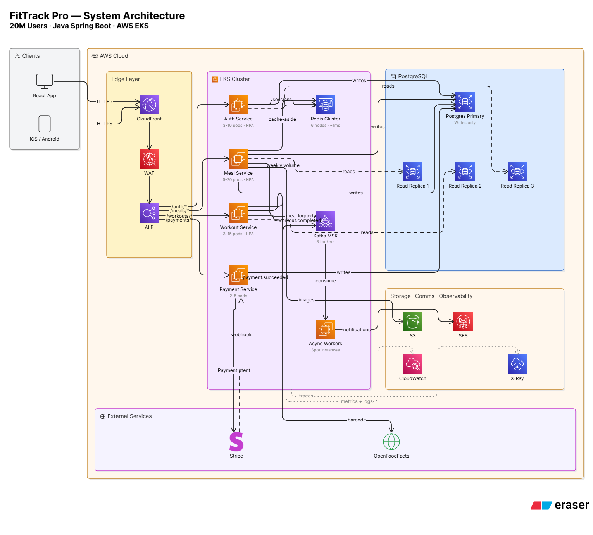
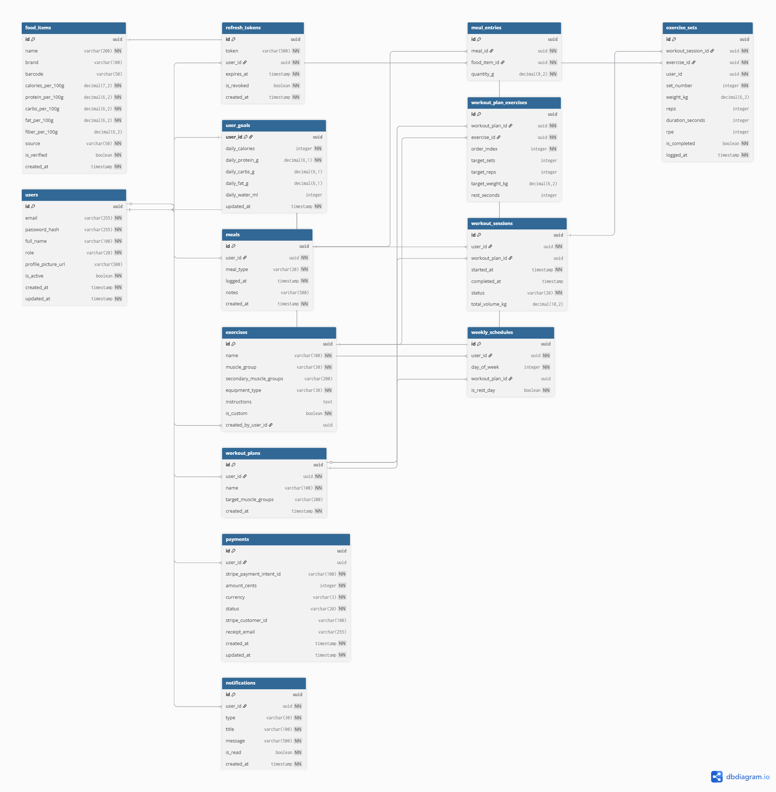

# FitTrack Pro

**Production-grade fitness and nutrition tracking API built with Java 21 + Spring Boot.**

Free and open source — no paywalls, no locked features. Built as a real-world demonstration of senior backend engineering patterns at 20M user scale: JWT auth with refresh token rotation, Redis caching with cache-aside invalidation, Kafka event streaming, Stripe webhook idempotency, and a 14-table PostgreSQL schema in 3NF.

> ⚠️ **Active Development** — Currently in Phase 1 (Core MVP). See [Build Status](#build-status) for progress.

---

## Architecture



*20M users · 5,200 peak RPS · Java Spring Boot · AWS EKS · Full request-flow trace in [`/docs/SYSTEM_DESIGN.md`](./docs/SYSTEM_DESIGN.md)*

---

## Database Schema



*14 tables · 3NF normalized · UUID primary keys · Table partitioning for scale · Full column annotations in [`/docs/schema.md`](./docs/schema.md)*

---

## Why This Project Exists

Most fitness apps lock macro tracking, barcode scanning, and goal analytics behind subscriptions. This project exists to prove that a production-quality backend can power all of it for free — and to demonstrate every pattern a senior backend engineer needs to know: from schema design to Kubernetes deployment.

---

## Tech Stack

| Layer | Technology | Why |
|---|---|---|
| API | Java 21 + Spring Boot 3 | Type safety, Spring Security, mature ORM |
| Database | PostgreSQL 15 (AWS RDS) | JSONB, window functions, UUID support, table partitioning |
| Cache | Redis (AWS ElastiCache) | ~1ms food lookups vs ~20ms DB; rate limiting; sessions |
| Messaging | Apache Kafka (AWS MSK) | Async events, replay, ordered per user, consumer groups |
| Payments | Stripe + idempotent webhooks | SHA256 idempotency key, UNIQUE constraint guard |
| Security | JWT (access 15min + refresh 7d) | Stateless, scales horizontally on EKS, BCrypt cost 12 |
| Containerization | Docker + Kubernetes (AWS EKS) | Rolling deploys, HPA auto-scaling 2–100 pods |
| CI/CD | GitHub Actions | Push to main → test → build → push ECR → deploy |
| Monitoring | CloudWatch + X-Ray + Actuator | Structured JSON logs, distributed tracing, P99 alarms |

---

## Key Engineering Decisions

**UUID primary keys over auto-increment** — No sequential ID exposure, distributed-system safe, client-side generation possible. B-tree fragmentation trade-off is negligible at this scale.

**Money stored as INTEGER cents** — Floating point is imprecise (`0.1 + 0.2 = 0.30000000000000004`). Integer cents are always exact. $10.00 = 1000 cents.

**Nutrition stored per 100g, computed dynamically** — Never store computed values. If source data changes, stored calculations go stale. `calories = (per_100g × quantity_g) / 100` on every read.

**Interface + Impl service pattern** — Controllers depend on the interface, never the implementation. Enables easy mocking in tests and implementation swaps without touching callers (Dependency Inversion Principle).

**Cache-aside with explicit invalidation** — Key: `daily:{userId}:{date}`. Invalidated on every new meal log. TTL: 25 hours. Cache hit: ~1ms. Cache miss with DB fallback: ~20ms. At 27M food lookups/day, 95%+ served from Redis.

**Kafka over synchronous notifications** — Meal log request returns at ~20ms and the HTTP response goes out. Notification worker processes the `meal.logged` event asynchronously on spot instances. Dead letter queue handles failures without blocking the partition.

**Idempotent Stripe webhooks** — Stripe can deliver the same event multiple times. `UNIQUE(stripe_payment_intent_id)` means a duplicate INSERT throws `DataIntegrityViolationException` — catch it, return 200 OK. The DB did the deduplication without any check-then-insert race condition.

**Read/write splitting** — PostgreSQL primary handles writes only. 3 read replicas handle all SELECT queries. At 3M DAU, reads outnumber writes ~10:1. PgBouncer pools 10K+ app connections to ~500 real DB connections.

**Table partitioning at scale** — `meals` RANGE partitioned by `logged_at` (monthly). `exercise_sets` HASH partitioned by `user_id` (64 partitions). Date-range queries only scan the relevant partition. User-scoped queries hit 1/64th of the data.

Full trade-off table with pros, cons, and verdicts in [`/docs/SYSTEM_DESIGN.md`](./docs/SYSTEM_DESIGN.md).

---

## Database Schema Overview

14 tables in 3NF. Every table has UUID primary key, `created_at` (immutable), and `updated_at` (auto-updated by Hibernate).

```
users
  ├── refresh_tokens          # JWT refresh token rotation + revocation
  ├── user_goals              # Daily nutrition targets (1:1 with users)
  ├── meals
  │     └── meal_entries ──── food_items    # Junction: qty_g only, macros computed
  ├── workout_plans
  │     └── workout_plan_exercises ──── exercises
  ├── workout_sessions
  │     └── exercise_sets                   # HASH partitioned by user_id
  ├── weekly_schedules                      # day_of_week → workout_plan mapping
  ├── payments                              # UNIQUE on stripe_payment_intent_id
  └── notifications                         # Created by Kafka workers, never deleted
```

---

## Project Structure

```
src/main/java/com/fittrack/
├── config/             # SecurityConfig, RedisConfig, KafkaConfig, StripeConfig
├── domain/
│   ├── entity/         # JPA @Entity classes — DB representation
│   ├── dto/
│   │   ├── request/    # Inbound API contracts
│   │   └── response/   # Outbound API contracts
│   └── enums/          # MealType, MuscleGroup, PaymentStatus, UserRole, etc.
├── repository/         # Spring Data JPA interfaces
├── service/            # Interfaces — define WHAT each service does
│   └── impl/           # Implementations — define HOW
├── controller/         # REST endpoints (@RestController)
├── security/           # JwtTokenProvider, JwtAuthenticationFilter
├── mapper/             # Entity ↔ DTO conversion (MapStruct)
├── kafka/              # Producers + @KafkaListener consumers
├── cache/              # RedisCacheService wrapper
└── exception/          # GlobalExceptionHandler (@ControllerAdvice)

docs/
├── architecture.png    # System architecture (Eraser.io)
├── erd.png             # Database ERD (dbdiagram.io)
├── SYSTEM_DESIGN.md    # Scale math, trade-offs, cost model
├── schema.md           # Column-level annotations and design rationale
└── adr/
    ├── ADR-001-java-over-nodejs.md
    ├── ADR-002-postgresql-over-mysql.md
    ├── ADR-003-uuid-over-autoincrement.md
    ├── ADR-004-jwt-stateless-auth.md
    ├── ADR-005-redis-cache-aside.md
    ├── ADR-006-kafka-over-rabbitmq.md
    └── ADR-007-monolith-over-microservices.md
```

---

## API Overview

| Method | Endpoint | Auth | Cache | Notes |
|---|---|---|---|---|
| POST | `/api/v1/auth/register` | — | — | BCrypt cost 12, rate limited |
| POST | `/api/v1/auth/login` | — | Rate limit | 5 attempts/min/IP via Redis |
| POST | `/api/v1/auth/refresh` | Refresh token | — | Issues new 15-min access token |
| POST | `/api/v1/meals` | Bearer | Invalidates | Publishes `meal.logged` to Kafka |
| GET | `/api/v1/meals/daily-macros` | Bearer | Redis 25h | JOIN FETCH, cache-aside |
| GET | `/api/v1/foods/search` | Bearer | Redis | pg_trgm full-text index |
| GET | `/api/v1/foods/barcode/{code}` | Bearer | Redis 24h | Redis → DB → Open Food Facts |
| POST | `/api/v1/workouts/sessions` | Bearer | — | Start a workout session |
| POST | `/api/v1/workouts/sessions/{id}/sets` | Bearer | — | Log set: weight, reps, RPE |
| GET | `/api/v1/workouts/volume/weekly` | Bearer | Redis | groupingBy MuscleGroup |
| POST | `/api/v1/donations` | Bearer | — | Creates Stripe PaymentIntent |
| POST | `/api/webhooks/stripe` | Stripe sig | — | Raw body, HMAC-SHA256 verified first |
| GET | `/actuator/health/liveness` | — | — | Kubernetes liveness probe |
| GET | `/actuator/health/readiness` | — | — | Kubernetes readiness probe |

Full interactive docs at `/swagger-ui.html` when running locally.

---

## Scale Targets

| Metric | Value | How |
|---|---|---|
| Total users | 20,000,000 | — |
| Daily active users | 3,000,000 | 15% DAU rate |
| Peak RPS | ~5,200 | 150M req/day ÷ 86,400s × 3× peak |
| Food lookups/day | 27,000,000 | 3M DAU × 3 meals × 3 items |
| DB queries saved/day | ~25,650,000 | 95% Redis cache hit rate |
| Meals table rows/year | ~3.28B | → RANGE partitioned by month |
| Exercise sets rows/year | ~876M | → HASH partitioned 64 ways |
| P50 latency target | 20ms | — |
| P99 latency target | 200ms | Alarm at 500ms |

---

## Build Status

**Phase 0 — Design** ✅
- [x] ERD designed on dbdiagram.io (14 tables, all relationships)
- [x] System architecture diagram (Eraser.io, AWS components)
- [x] ADRs written for all major technology decisions
- [x] Scale math documented (traffic projections, storage estimates)

**Phase 1 — Core MVP: Auth + Meal Tracking** 🚧
- [ ] User entity + Spring Security UserDetails integration
- [ ] JWT auth — register / login / refresh / logout
- [ ] FoodItem entity + search endpoint (pg_trgm)
- [ ] Meal + MealEntry entities (computed macro pattern)
- [ ] Daily macro calculation endpoint
- [ ] Deploy to Railway.app — get a live URL

**Phase 2 — Workout Tracker** ⬜
- [ ] Exercise entity + MuscleGroup enum
- [ ] WorkoutPlan + WorkoutPlanExercise (many-to-many)
- [ ] WorkoutSession + ExerciseSet logging
- [ ] Weekly volume by muscle group (Collectors.groupingBy)
- [ ] WeeklySchedule entity

**Phase 3 — Redis + Kafka** ⬜
- [ ] Redis: food item cache (benchmark before/after latency)
- [ ] Redis: daily macro cache with invalidation on write
- [ ] Redis: rate limiting — 5 login attempts/min/IP
- [ ] Kafka: `meal.logged` topic + notification consumer
- [ ] Dead letter queue for failed notifications
- [ ] Barcode scanner: Redis → DB → Open Food Facts fallback chain

**Phase 4 — Stripe Payments** ⬜
- [ ] POST /api/v1/donations → Stripe PaymentIntent
- [ ] Idempotent webhook handler (raw body, verify-then-parse)
- [ ] UNIQUE constraint deduplication guard
- [ ] Payment receipt via AWS SES

**Phase 5 — Docker + Kubernetes + AWS** ⬜
- [ ] Multi-stage Dockerfile (~150MB image)
- [ ] Docker Compose: app + postgres + redis + kafka
- [ ] AWS EKS deployment with HPA (min 2, max 10 pods)
- [ ] GitHub Actions CI/CD: test → build → push ECR → deploy
- [ ] CloudWatch alarms: error rate > 1%, P99 > 500ms
- [ ] AWS X-Ray distributed tracing
- [ ] k6 load test — 1,000 concurrent users, screenshot HPA scaling

---

## Running Locally

**Prerequisites:** Java 21, Maven, Docker

```bash
git clone https://github.com/Su1kii/fittrack-pro.git
cd fittrack-pro

# Start dependencies
docker-compose up -d postgres redis kafka

# Configure environment
cp src/main/resources/application.example.yml src/main/resources/application-local.yml
# Edit application-local.yml with your DB credentials

# Run
./mvnw spring-boot:run -Dspring-boot.run.profiles=local
```

**App:** `http://localhost:8080`  
**Swagger UI:** `http://localhost:8080/swagger-ui.html`  
**Health:** `http://localhost:8080/actuator/health`

---

## Contributing

Issues and PRs welcome. If there's a feature you wish a fitness app had without a paywall, open an issue.

For significant changes, open an issue first to discuss the approach.

---

## License

MIT — free forever, for everyone.